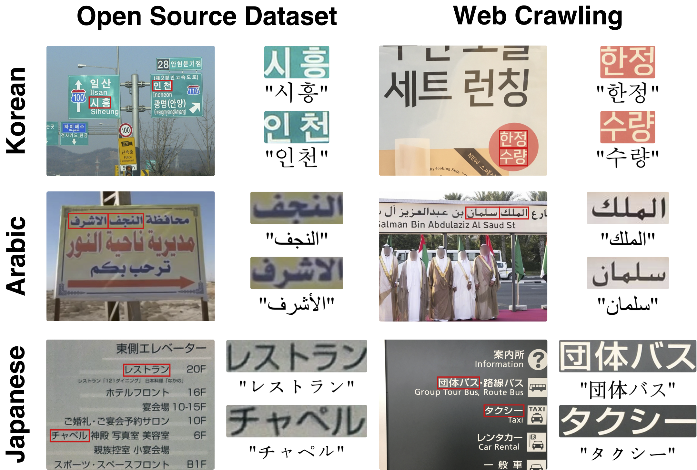

# STIPLAR: Scene Text Image Pairs of Low-resource lAnguage and Real-world data
- STIPLAR is a real-world scene text image dataset containing Korean, Arabic, and Japanese text image pairs collected from MLT-2019 and web sources, designed for fine-tuning STELLAR on low-resource languages.



## Dataset
For Stage 2 training, we utilize `STIPLAR`, our newly proposed scene text image pairs of low-resource language and real-world data. The dataset for each language can be downloaded from [link](https://drive.google.com/drive/folders/1nI7SjtXikB4pkPVw7HKTop8nJOKLR3ut?usp=sharing).

## Evaluation
Download the STIPLAR-eval dataset from [Link](https://drive.google.com/drive/folders/1Nyum75Q3e9Qb_7bhLLQFvPSNRlcEkcF8?usp=sharing) and unzip the files.
```bash
├── anonymous-stellar/
│   ├── STIPLAR-ko-eval/
│   ├── STIPLAR-ar-eval/
│   └── STIPLAR-jp-eval/
```